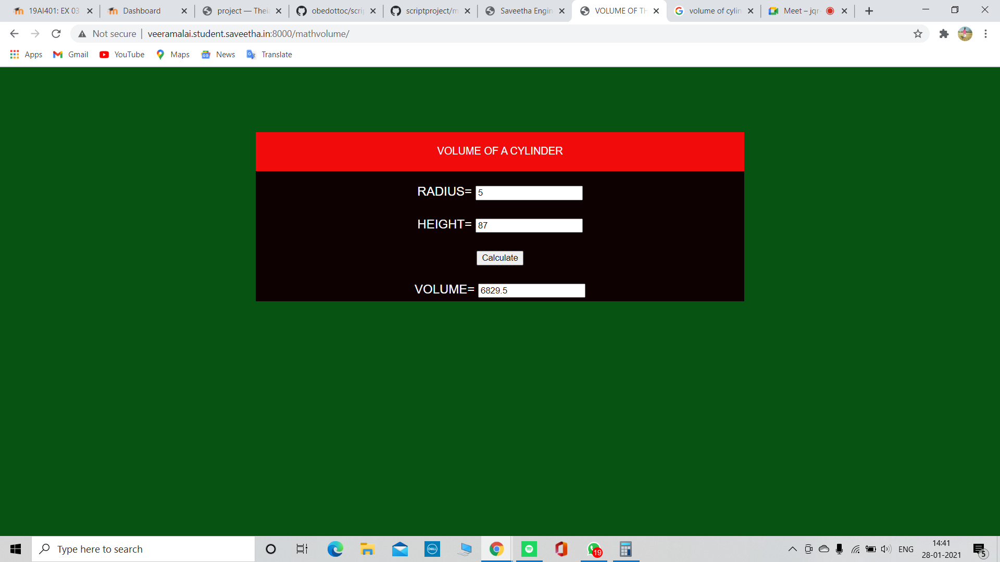

# Mathematical Calculations using JavaScript
## AIM:
To design a website to calculate the area of a circle and volume of a cylinder using JavaScript.

## DESIGN STEPS:
### Step 1: 
Requirement collection.
### Step 2:
Creating the layout using HTML and CSS.
### Step 3:
Write JavaScript to perform calculations.
### Step 4:
Choose the appropriate style and color scheme.
### Step 5:
Validate the layout in various browsers.
### Step 6:
Validate the HTML code.
### Step 6:
Publish the website in the given URL.


## PROGRAM:

## mathvolume.html
```

<!DOCTYPE html>
<html>

<head>
    <title>VOLUME OF THE CYLINDER</title>
    <link rel="stylesheet" href="">
</head>

<body>
    <div class="container">
        <div class="formview">
            <div class="banner">
                VOLUME OF A CYLINDER
            </div>
            <div class="content">
                <form action="" method="GET">
                    
                    <div class="forminput">
                        <label for="value_radius">RADIUS=</label>
                        <input type="text" name="value_radius" id="value_radius">
                    </div>
                    <div  class="forminput">
                        <label for="value_height">HEIGHT=</label>
                        <input type="text" name="value_height" id="value_height">
                    </div>                    
                    <div class="forminput">
                        <button type="button" name="button_calculate" id="button_calculate">Calculate</button>
                    </div>
                    <div class="forminput">
                        <label for="value_volume">VOLUME=</label>
                        <input type="text" name="value_volume" id="value_volume" readonly>
                    </div>
                </form>
            </div>
        </div>
    </div>
    <script src="/static/js/mathvolume.js"></script>
</body>

</html>
```
## matharea.html
```

<!DOCTYPE html>
<html>

<head>
    <title>AREA OF CIRCLE</title>
    <link rel="stylesheet" href="">
</head>

<body>
    <div class="container">
        <div class="formview">
            <div class="banner">
                AREA OF CIRCLE
            </div>
            <div class="content">
                <form action="" method="GET">
                    
                    <div class="forminput">
                        <label for="value_radius">RADIUS=</label>
                        <input type="text" name="value_radius" id="value_radius">
                    </div>
                    <div class="forminput">
                        <button type="button" name="button_calculate" id="button_calculate">Calculate</button>
                    </div>
                    <div class="forminput">
                        <label for="value_area">AREA=</label>
                        <input type="text" name="value_area" id="value_area" readonly>
                    </div>
                </form>
            </div>
        </div>
    </div>
    <script src="/static/js/matharea.js"></script>
</body>

</html>
```

## mathvolume.js
```

CalculateBtn = document.querySelector('#button_calculate');

CalculateBtn.addEventListener('click',function(e){
    txtRADIUS = document.querySelector('#value_radius');
    txtHEIGHT = document.querySelector('#value_height');
    txtVOLUME = document.querySelector('#value_volume');

    let volume;

    volume = 3.14 * parseFloat(txtRADIUS.value) * parseFloat(txtRADIUS.value) * parseFloat(txtHEIGHT.value);

    txtVOLUME.value = volume;
});
```
## matharea.js
```
CalculateBtn = document.querySelector('#button_calculate');

CalculateBtn.addEventListener('click',function(e){
    txtRADIUS = document.querySelector('#value_radius');
    
    txtAREA = document.querySelector('#value_area');

    let area;

    area = 3.14 * parseFloat(txtRADIUS.value) * parseFloat(txtRADIUS.value);

    txtAREA.value = area;
});
```


## OUTPUT:



## RESULT:
Thus a website is designed to find volume of cylinder and area of circle and is hosted in the URL 
http://veeramalai.student.saveetha.in:8000/mathvolume/ , http://veeramalai.student.saveetha.in:8000/matharea/ HTML code is validated.